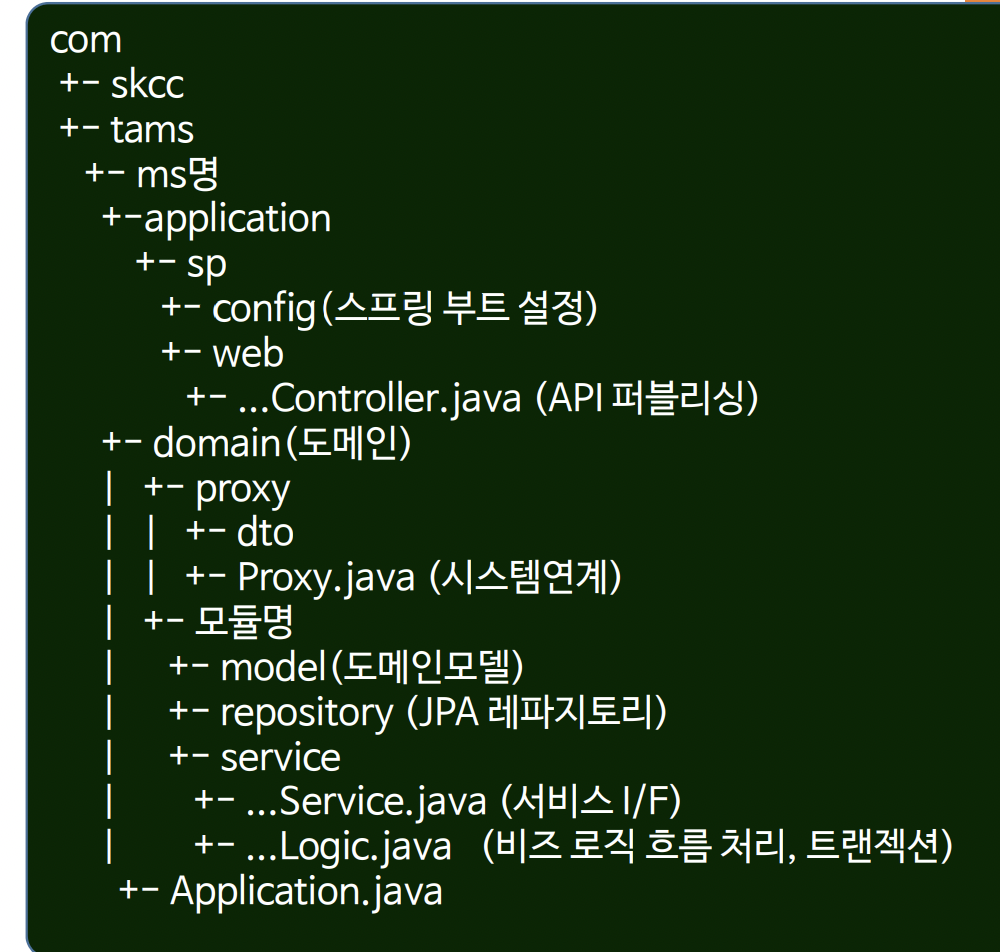
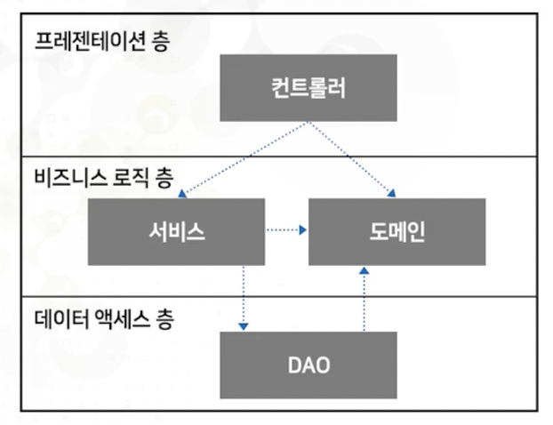
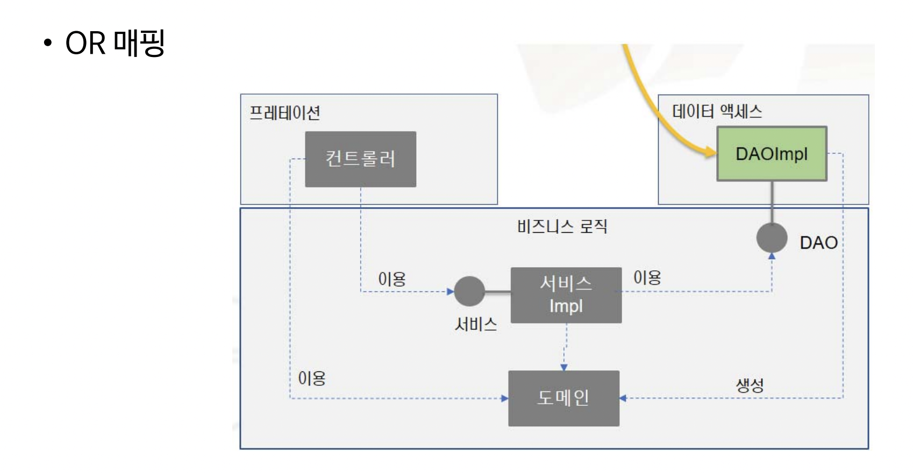
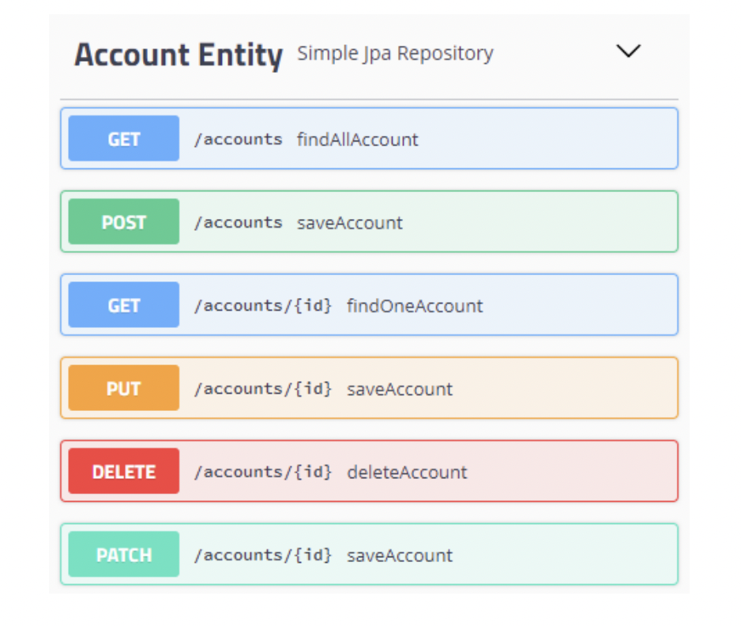
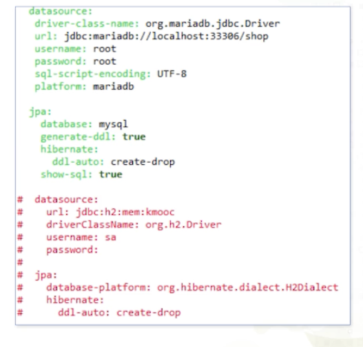

# KMOOC_MSA

SK C&C와 Kaist의 합동강의인
[Microservice 설계 및 구현](http://www.kmooc.kr/courses/course-v1:KAISTk+2018_K14+2021_K14_01/about) 의 실습을 구현한 자료입니다.  
[SK C&C MSA 방법론](https://github.com/CNAPS-MSA/CNAPS3) 에서 더 자세한 내용을 학습하실 수 있습니다.  


# 환경 설정
spring-data-jpa  
spring-data-rest  
spring-starter-web  
h2 database  
springfox-swagger2  => springdoc-openapi-ui 
springfox-data-rest => springdoc-openapi-data-rest

# 마이크로서비스 내부 패키지 구조 정의
비즈니스 로직의 결과를 브라우저에 표현하는 기술이나    
데이터베이스에 저장하는 기술들이  
비즈니스 로직에 영향을 미치지 않도록 하는 것이 좋은 설계    
> config는 springFox 제외로 미포함.






|   레이어   |     용어     |                           정의                            |
|:-------:|:----------:|:-------------------------------------------------------:|
| 프리젠테이션  |    컨트롤러    |                      라우팅, 인터랙션, 세션                      |
| 비즈니스 로직 | 애플리케이션 서비스 | 도메인 클래스 이용 업무 처리 (오케스트레이션 - 로직흐름처리, 트랜잭션), stateless 계층 |
| 비즈니스 로직 |    도메인     |                     비즈니스 실행 클래스 집합                      |
| 데이터 엑세스 |    DAO     |                       데이터 저장소 처리                        |


# OR 매핑  
OR 매핑은 Business Logic에 필요한 객체가 무엇인지를 먼저 고려  
비즈니스를 처리하는 흐름을 구현한 뒤 나중에 저장소를 결정    
Object에 Mapping하여 데이터를 처리하는 방식.
따라서 Business Logic 층이 Domain Model 구조로 설계된 경우 유용한 방식입니다.



# Spring Data JPA+ REST
컨트롤러와 서비스 코드 작성 없이   
Domain 클래스와 Repository 인터페이스만으로 Rest API 자동 생성  
- domain 클래스와 repository 인터페이스만 작성하면
  - Rest API 자동 생성
  - SQL 쿼리 작성이 없이, CRUD 자동 생성
  - DB table 자동 생성


```java
@RepositoryRestResource
public interface AccountRepository extends PagingAndSortingRepository<Account,Long> {
    Account findByName(@Param("name") String name);
}
```

# Swagger를 활용한 API 명세 테스트 & h2 데이터베이스를 mariaDB로 변경
> application.yml 파일을 확인하시기 바랍니다.  
> 
mariaDB 클라이언트를 의존성에 추가해야 합니다. (저는 스킵했습니다.) 


데이터 중심이 아닌 도메인 객체를 중심으로 설계하면  
데이터베이스와 같은 외부 기술 변화에도 비즈니스 로직에 전혀 영향이 없습니다.
(yaml만 변경하는 것으로 가능합니다!)
